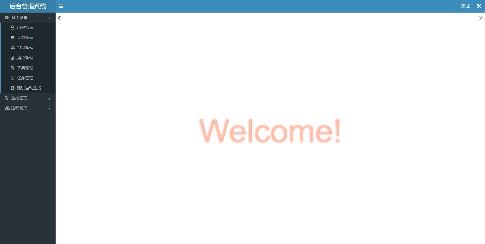
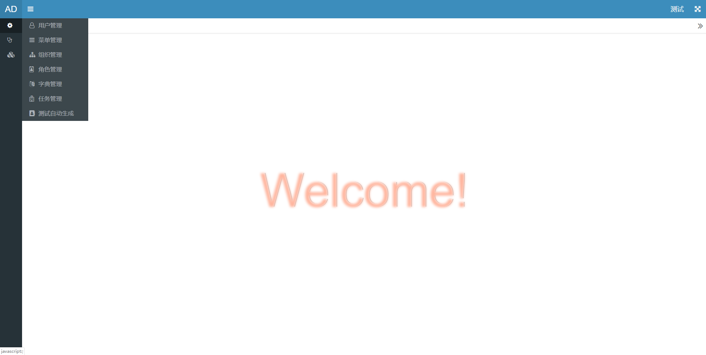
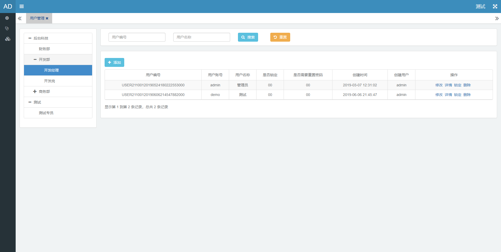
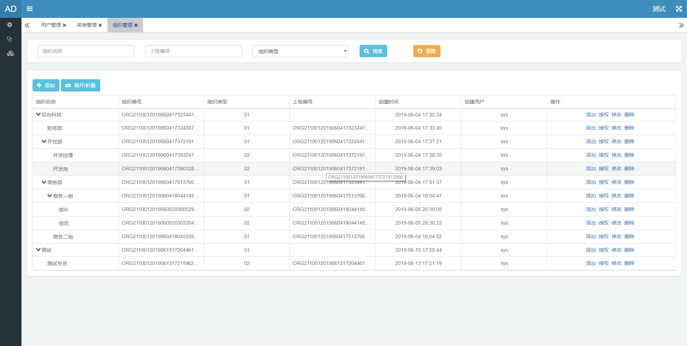
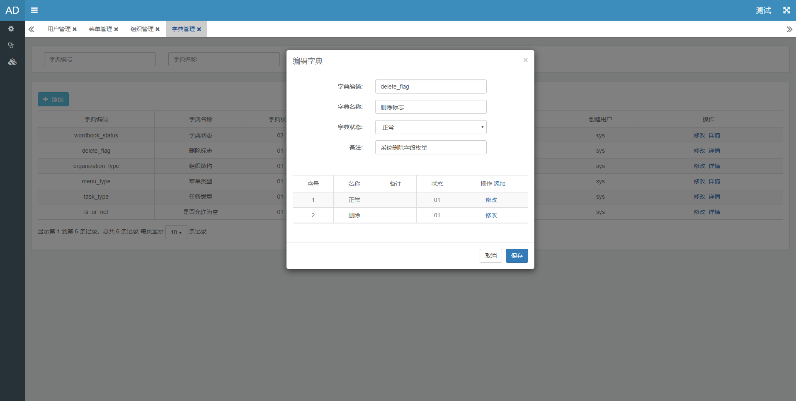
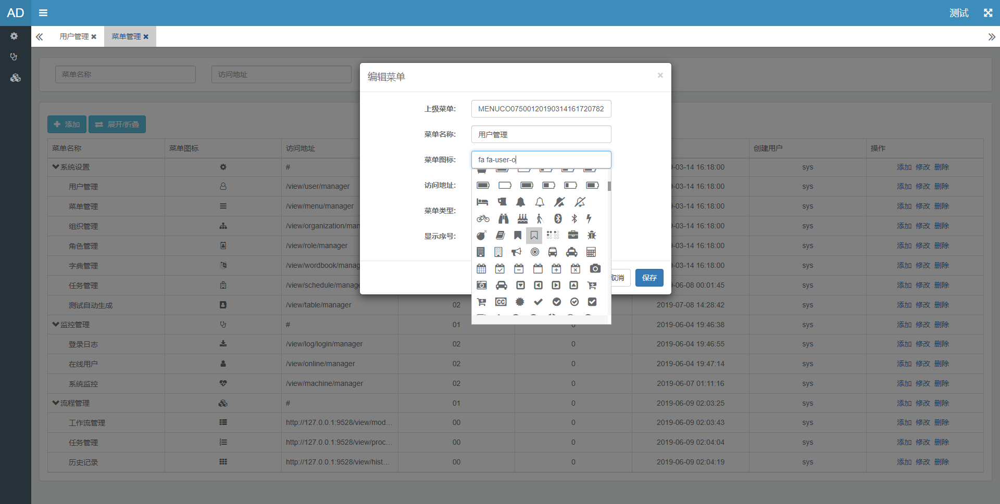
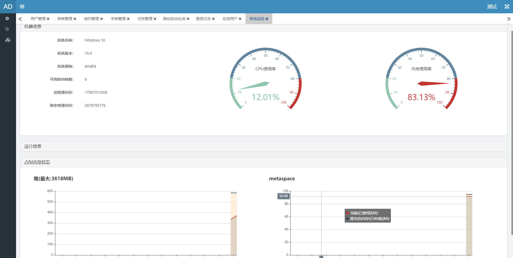

管理系统(admin)
===========================

##环境依赖
jdk:1.8.0+
tomcat:8+
##部署步骤
1. 导入IDE
2. 修改数据库连接
3. 启动 AdminApplication.java

##基础目录结构描述
├── Readme.md                             // 自述文件  
├── pom.xml                               // pom文件  
├── src.main                              // pom文件  
│   ├── java.com.java                    //代码目录  
│   │   ├── business                    //业务目录  
│   │   ├── general                     //系统通用配置目录  
│   │   │   ├── demo                   //业务模块  
│   │   │   │   ├── constant          //模块内常量  
│   │   │   │   ├── controller              
│   │   │   │   ├── dto               //数据传输  
│   │   │   │   ├── entity            //数据库实体对象  
│   │   │   │   ├── facade            //facade层模型对象操作层  
│   │   │   │   ├── mapper            //数据库mapper接口映射  
│   │   │   │   ├── service           //service 数据库对象操作层  
│   │   │   │   ├── utils             //模块工具类  
│   │   ├── AdminApplication.java       //springboot启动类  
│   ├── resource                         //资源文件   
│   │   ├── config                      //profiles配置   
│   │   │   │   ├── dev               //开发  
│   │   │   │   ├── test              //测试  
│   │   ├── mapper                      //mybatis xml存放 对应各自业务模块  
│   │   │   │   ├── demo                 
│   │   ├── application.properties      //通用配置  
│   │   ├── banner.txt                   
│   │   ├── generatorConfig.xml                   
│   │   ├── logback.xml                   
│   ├── webapp                           //页面文件  
│   │   ├── static                      //静态资源   
│   │   │   │   ├── vendor            //前端插件                                
│   │   ├── templates                   //页面文件  

##页面示例

